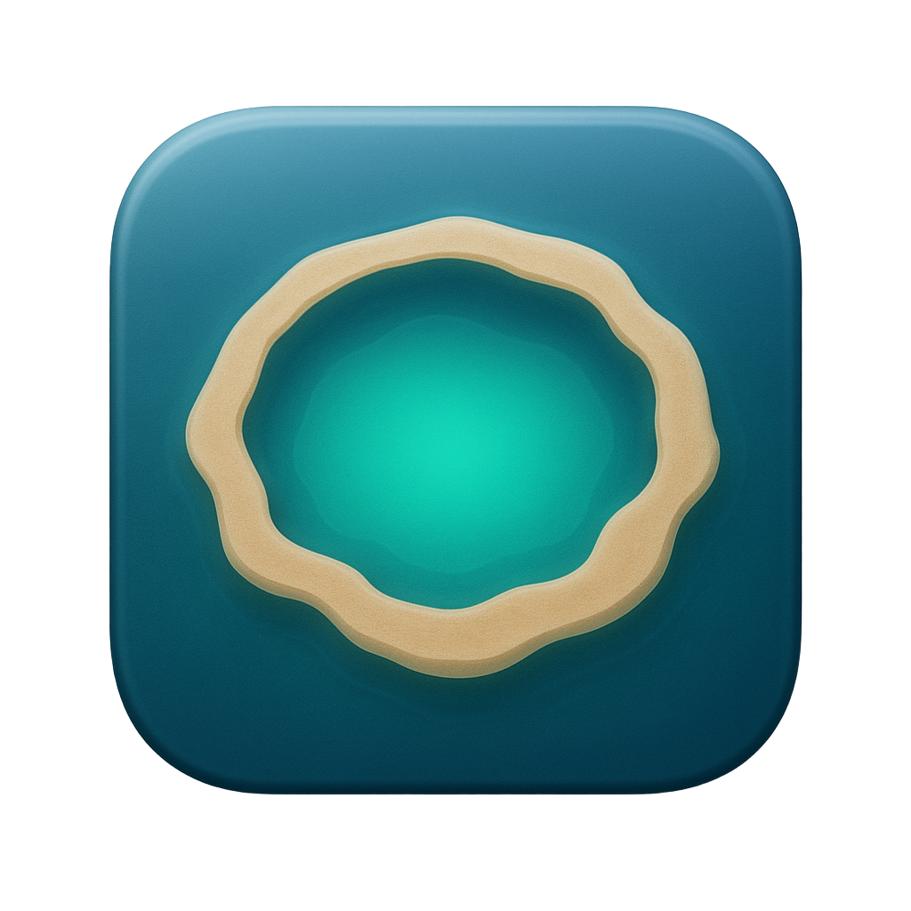
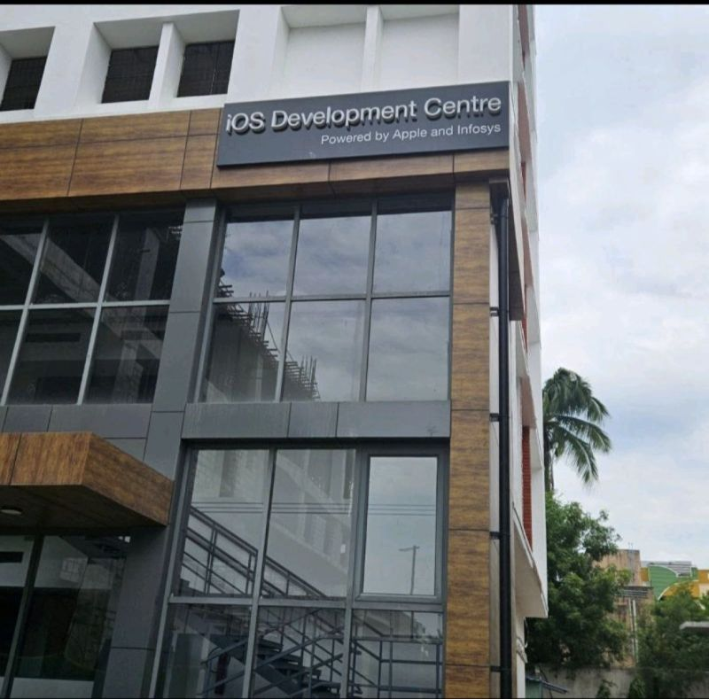

<p align="center">
  
</p>
<h1 align="center">Atoll Codex Integration</h1>
<p align="center">基于 Atoll 的本地 Codex 任务状态模块</p>

> **本项目不是官方 Atoll。** 它基于 [Ebullioscopic/Atoll](https://github.com/Ebullioscopic/Atoll) 开源，并将 Codex 集成作为主要新增能力。

如果你只想了解这个仓库新增了什么，请先看下面的 **Codex 模块**。上游 Atoll 的原始介绍和功能列表已放到后面的“上游 Atoll 基础能力”章节。来源、许可证和差异说明见 [UPSTREAM.md](UPSTREAM.md)、[NOTICE](NOTICE) 和 [LICENSE](LICENSE)。

## Codex 模块

Codex 是本项目的主要新增能力：它把本地 Codex coding agent 的任务状态接入 Atoll，让你不必一直切回终端或 Codex 窗口，也能在 MacBook 刘海处看到任务进展、等待批准和完成结果。这个模块不是另一个 AI 客户端，也不执行 Codex 任务；它负责接收 Codex Hooks、保存必要的本地状态，并把状态转换成 Atoll 的刘海提示、动效、任务页和活动托盘。

### 一、Codex 状态从哪里来

Atoll 通过包内的 `CodexHookHelper` 接收 Codex Hook 事件，并按会话（`sessionID`）维护本地任务记录。当前接入的事件包括：

| Hook 事件 | Atoll 中的处理 |
| --- | --- |
| `SessionStart` | 创建或恢复会话，记录项目目录、项目名和模型信息。恢复旧会话时，会把同一会话之前的完成记录标记为已处理。 |
| `UserPromptSubmit` | 开始一轮新的 Codex 工作，保存清洗后的提示词摘要，状态变为“进行中”，触发蓝色进行中提示。 |
| `PermissionRequest` | 任务需要用户批准工具或操作，状态变为“等待批准”，保存经过清洗的批准说明，使用橙色提示。 |
| `PostToolUse` | 工具调用完成；如果之前在等待批准，则恢复为“进行中”。 |
| `Stop` | 当前轮次完成，保存结果摘要，生成一条完成记录，并触发绿色完成提示。 |
| `SessionEnd` | 会话结束，停止继续作为活跃任务展示。 |

重复事件会按事件 ID 去重，乱序或过期事件不会覆盖较新的会话状态。默认超过 **45 分钟**没有新 Hook 的运行中或等待批准任务会被标记为“异常 / 可能失联”，而不是继续伪装成正常运行。

### 二、刘海关闭态：一眼看懂当前状态

当刘海处于关闭状态时，Codex 作为 Atoll 的一个 Live Activity 出现在刘海的辅助区域。关闭态不展示完整任务列表，而是把最重要的状态压缩成一条计数摘要：

- `3 · 已完成`：有 3 个未查看完成记录；
- `1 · 等待批准`：有 1 个会话需要用户决定；
- `2 · 进行中`：有 2 个会话正在执行。

摘要采用固定优先级：**未查看完成 > 等待批准 > 进行中**。因此同时存在“已完成”和“进行中”时，右侧摘要会优先告诉你有新的完成结果；左侧仍会保留进行中的动态忙碌效果，避免把两类信息混成一条难以理解的文案。

如果没有任何活跃任务或未读完成记录，关闭态不占用 Codex 状态位，但展开页仍可以保留 Codex 任务标签和明确的空状态。

### 三、进行中的动态效果

只要存在任意进行中的 Codex 会话，刘海左侧会显示专用的忙碌动效：

- 深靛蓝玻璃终端卡片；
- 两行代码流逐行推进；
- 跟随当前代码行移动的闪烁光标；
- 轻微呼吸式光晕和边框变化；
- 开启“减少动态效果”时自动降低为静态版本。

当 Codex 刚收到新的 `UserPromptSubmit` 时，会额外触发一次进行中入场提示：项目名以低对比度显示，下面展示本轮对话主题；主题过长时使用跑马灯，并在边缘做渐隐收束。这个进行中提示持续约 **6 秒**，随后恢复为稳定状态。后台每 0.5 秒刷新 Hook 不会把这段动效提前打断；只有新的状态事件或用户设置变更才会接管展示。

### 四、等待批准：需要用户处理的任务

收到 `PermissionRequest` 后，会话从“进行中”切换到“等待批准”：

- 关闭态摘要变为橙色的“等待批准”；
- 临时提示使用感叹号图标；
- 展开任务页中会显示“等待批准”状态、项目名和经过清洗的批准说明；
- 活动托盘中进入“需要处理”分组；
- 卡片的下一步提示是“打开 Codex 处理”。

Atoll 不代替用户批准或拒绝操作。点击卡片只负责打开对应 Codex 会话，让用户在 Codex 原生界面中完成决定。

### 五、已完成：绿色庆祝、未读计数和历史记录

收到 `Stop` 后，Atoll 会保存项目名、提示摘要、结果摘要和完成时间，并把该会话放入“已完成”记录。

新的完成事件会触发约 **3.5 秒**的绿色完成提示：

- 绿色勾选图标；
- 环形扫光；
- 克制的微粒扩散；
- 项目名与完成内容分层显示；
- 完成状态使用绿色文字、背景和边框共同表达。

完成记录不会因为提示出现过就立刻清零。系统会区分“已展示”和“已读”：

1. 绿色完成卡片第一次进入活动托盘的可视区域时，只记录“已经展示过”，仍保持高亮。
2. 用户点击完成卡片时，会先确认对应会话，再打开 Codex 对话。
3. 用户关闭活动托盘时，当前展示周期内真正进入可视区域的完成会话才会被标记为已读。
4. 已读完成不会消失，而是转入灰色的“历史完成”分组。没有滚动到可视区域的完成项继续保留未读计数。

同一 Codex 会话多轮完成时，活动托盘只保留该会话最新的一张完成卡片；当该会话再次开始新一轮任务，旧完成记录会被确认，新一轮重新进入“进行中”。

### 六、展开任务页：最多 6 个独立对话区块

点击刘海或切换到 Codex 标签后，会进入 Codex 展开任务页。任务页高度约 **420pt**，最多直接展示 **6 个独立对话区块**，每个区块包含：

- 项目名；
- 清洗后的用户提示或对话主题；
- 当前状态和状态时长；
- 相关内容摘要（批准说明、工具名或完成结果）；
- 对应的 Codex 会话跳转入口。

区块按状态优先展示：等待批准、进行中、最近完成。状态同时使用文字和颜色表达：

- 蓝色：进行中；
- 橙色：等待批准；
- 绿色：已完成；
- 红色或警示色：异常 / 可能失联。

每个区块是一个整体点击目标，不需要精确点到某个小按钮。鼠标悬停时背景和描边会增强，点击项目名、状态或正文区域的任意位置，都会打开同一个 Codex 会话。任务页不足 6 条时显示全部；超过 6 条时通过滚动查看剩余内容。没有任务时显示“新任务开始后会自动显示在这里”的空状态。

### 七、活动托盘：按优先级整理所有任务

活动托盘是比展开任务页更完整的抽屉式列表，标题为“活动托盘”，会显示当前可见任务总数并按优先级分组：

1. **需要处理**：等待批准的会话；
2. **异常 / 可能失联**：任务中断或超过超时时间没有收到新 Hook 的会话；
3. **最新完成**：尚未确认的完成记录；
4. **进行中**：当前仍在执行的会话；
5. **历史完成**：已经确认的完成记录。

每个分组都显示数量。项目会在分组内再次聚合，同一项目的多个会话放在一起；固定项目优先排列，组内按最近活动时间排序。

抽屉的默认交互规则：

- “需要处理”“异常”“最新完成”“进行中”默认展开；
- “历史完成”默认折叠；
- 项目组可以临时折叠；
- 这些折叠状态只在本次打开期间有效，关闭后不会持久化；
- 历史完成默认先显示 10 条，点击“查看更多历史对话”后再展开其余记录；
- 完成记录默认保留 7 天，最多保留 100 条紧凑记录。

抽屉关闭时才提交未读确认，因此用户只是打开抽屉、还没真正看到底部内容时，不会误把所有完成任务标记为已读。

### 八、点击如何跳转到对应 Codex 对话

每个任务记录都保留自己的 `sessionID`。展示层会把它编码为 Codex 深链：

```text
codex://threads/<sessionID>
```

用户点击展开任务页区块或活动托盘卡片后，Atoll 通过 macOS `NSWorkspace` 激活已安装的 Codex App，并打开对应深链；完成提示本身负责把注意力带回 Codex 状态，具体会话跳转仍由任务区块或活动托盘卡片完成。具体行为是：

1. 先生成并校验 `codex://threads/...` 地址；
2. 优先查找 Bundle ID 为 `com.openai.codex` 的 Codex App；
3. 找不到时再尝试让 macOS 根据 URL 选择可处理的应用；
4. 找不到可用应用或 URL 无效时，在 Atoll 设置中报告错误，不吞掉失败；
5. 点击完成卡片时，完成确认和打开会话是同一次用户操作的一部分。

这意味着 Atoll 不需要读取 Codex transcript，也不需要知道 Codex 对话内部的消息结构；它只保存会话 ID，并把用户带回 Codex 原生界面。

### 九、设置项和隐私控制

入口：**Atoll Settings → Utilities → Codex**。当前设置包括：

- **启用 Codex 状态集成**：关闭后停止 Hook 处理、停止展示并清理内置展示；
- **在刘海关闭态显示任务摘要**：控制关闭态 Live Activity；
- **在展开页显示 Codex 任务**：控制 Codex 任务标签；
- **任务完成时显示提示**：控制绿色完成提示；
- **在全屏应用中继续显示 Codex 状态**：独立控制 Codex 全屏可见性，不要求 Atoll 全局关闭隐藏；
- **显示任务内容摘要**：开启时显示清洗后的提示、批准和结果摘要，关闭后只显示项目名和状态；
- **安装或修复**：复制包内 `CodexHookHelper`、安装或修复 Codex Hooks；
- **卸载 Hooks**：移除本项目安装的 Hook，不影响其他未知 Hook；
- **诊断**：查看运行任务、等待批准、最近完成、待处理事件和失败事件数量，并打开本地数据目录。

集成使用本地 Codex Hooks 和本地状态文件；不解析 transcript，不上传 prompt、源码或终端输出，也不启动用于 Atoll 集成的网络服务。关闭任务内容摘要后，展示层会主动去除提示、批准和结果文本，只保留项目名、状态和时间信息。实现状态、验证证据和仍需人工验收的边界见 [docs/IMPLEMENTATION_STATUS.md](docs/IMPLEMENTATION_STATUS.md)。

## 上游 Atoll 基础能力

本项目保留上游 Atoll 的 macOS 刘海体验，包括媒体控制、系统信息、Live Activities、计时器、剪贴板和其他快捷工具。这些属于上游 Atoll 的基础能力；本仓库的主要新增能力是上面的 Codex 模块。

<p align="center">
  
</p>


### 上游 Atoll 功能概览
- Media controls for Apple Music, Spotify, Cider, and more with inline previews.
- Live Activities for media playback, Focus, screen recording, privacy indicators, downloads (beta), and battery/charging.
- Lock screen widgets for media, timers, charging, Bluetooth devices, and weather.
- Lightweight system insight for CPU, GPU, memory, network, and disk usage.
- Productivity tools including timers, clipboard history, color picker, and calendar previews.
- Customization for layouts, animations, hover behavior, and shortcut remapping.

## Other Features
- Gesture controls for opening/closing the notch and media navigation.
- Parallax hover interactions with smooth transitions.
- Lock screen appearance and positioning controls for panels and widgets.

<p align="center">
  
</p>

## Requirements
- macOS 14.0 or later (optimised for macOS 15+).
- MacBook with a notch (14/16‑inch MBP across Apple silicon generations).
- Xcode 15+ to build from source.
- Permissions as needed: Accessibility, Camera, Calendar, Screen Recording, Music.

## Development Run

Unless a Release package is explicitly required, use the Debug app for development and UI verification instead of packaging or copying a new app into `/Applications`:

```bash
./scripts/dev-run
```

It reuses a fixed DerivedData directory for incremental Debug builds, stops every running Atoll instance, and launches only the app produced from the current working tree. The Debug app is named **Atoll Dev**, uses the existing `com.Ebullioscopic.Atoll.dev` bundle identifier, and is ad-hoc signed so local development does not require the release team's signing certificate.

Running the `DynamicIsland` scheme with Xcode's Run command provides the same incremental build/debug workflow and now stops stale Atoll processes before launch.

Do not create or retain extra `.app` copies for individual changes. `/Applications/Atoll.app` may remain installed as the Release copy, but it must not run at the same time as **Atoll Dev**. Before accepting a runtime result, verify that the active executable comes from `DerivedData/Dev/Build/Products/Debug/Atoll.app` and that its bundle identifier is `com.Ebullioscopic.Atoll.dev`.

### Build cache and release retention

Use one canonical cache per build configuration:

- Debug: `DerivedData/Dev` via `./scripts/dev-run`
- Release: `DerivedData/Release` only when a formal package is explicitly requested
- Release output: one latest artifact under `build/releases`

Do not pass a new `-derivedDataPath`, create commit- or timestamp-named build directories, or leave Atoll test files in `/private/tmp`. Xcode's DerivedData contains all dependency and module caches, so changing the path repeatedly multiplies disk usage without changing the source product.

To remove historical caches, logs, test binaries, and old release artifacts while keeping the current Debug cache:

```bash
./scripts/clean-build-artifacts
```

Use `--dry-run` to inspect the candidates first. Use `--all` only when a complete rebuild is intentional; it also removes `DerivedData/Dev`. The script moves candidates to a recoverable Trash quarantine instead of permanently deleting them.

## Installation
当前仓库暂未发布独立 DMG。请先按 [Development Run](#development-run) 从源码运行，或使用 Xcode 构建当前分支；这样运行的才是包含 Codex 模块的版本。

## Quick Start
- Hover near the notch to expand; click to enter controls.
- Use tabs for Media, Stats, Timers, Clipboard, and more.
- Adjust layout, appearance, and shortcuts from Settings.
- Add files to Shelf from Terminal: `open -a Atoll /path/to/file`.

## Settings
- Choose appearance, animation style, and per‑feature toggles.
- Remap global shortcuts and adjust hover behaviour.
- Enable lock screen widgets and select data sources.

## Gesture Controls
- Two-finger swipe down to open the notch when hover-to-open is disabled; swipe up to close.
- Enable horizontal media gestures in **Settings → General → Gesture control** to turn the music pane into a trackpad for previous/next or ±10 second seeks.
- Pick the gesture skip behaviour (track vs ±10s) independently from the skip button configuration so swipes can scrub while buttons change tracks—or vice versa.
- Horizontal swipes trigger the same haptics and button animations you see in the notch, keeping visual feedback consistent with tap interactions.

## Troubleshooting (Basics)
- After granting Accessibility or Screen Recording, quit and relaunch the app.
- If metrics are empty, enable categories in Settings → Stats.
- Media not responding: verify player is active and Music permission is granted.

## License
Atoll is released under the GPL v3 License. Refer to [LICENSE](LICENSE) for the full terms.

This repository is a derivative work of Atoll. The Atoll source, its upstream notices, and the GPL v3 terms remain applicable. Changes specific to the Codex utility are maintained in this repository and should not be presented as part of the official upstream Atoll project.

## Acknowledgments

Atoll builds upon the work of several open-source projects and draws inspiration from innovative macOS applications:

- [**Boring.Notch**](https://github.com/TheBoredTeam/boring.notch) - foundational codebase that provided the initial media player integration, AirDrop surface implementation, file dock functionality, and calendar event display. Major architectural patterns and notch interaction models were adapted from this project.

- [**Alcove**](https://tryalcove.com) - primary inspiration for the Minimalistic Mode interface design and the conceptual framework for lock screen widget integration that informed Atoll's compact layout strategy.

- [**Stats**](https://github.com/exelban/stats) - source implementation for CPU temperature monitoring via SMC (System Management Controller) access, frequency sampling through IOReport bindings, and per-core CPU utilisation tracking. The system metrics collection architecture derives from Stats project readers.

- [**Open Meteo**](https://open-meteo.com) - weather apis for the lock screen widgets

- [**SkyLightWindow**](https://github.com/Lakr233/SkyLightWindow) - window rendering for Lock Screen Widgets

- [**rtaudio**](https://github.com/ZephyrCodesStuff/rtaudio) - Live music visualizer using C++ was adapted from this project

- [**SwiftTerm**](https://github.com/migueldeicaza/SwiftTerm) - Terminal tab implementation in the standard mode was adapted from this project

- [**DynamicNotch**](https://github.com/jackson-storm/DynamicNotch) - thanks DynamicNotch for letting us use their battery huds

- Wick - Thanks Nate for allowing us to replicate the iOS like Timer design for the Lock Screen Widget

- [**OpenUsage**](https://github.com/robinebers/openusage) - LLM Usage Tracking features

- [**OpenRouter**](https://openrouter.ai) - API for getting automated model pricing

## Contributors

<a href="https://github.com/Ebullioscopic/Atoll/graphs/contributors">
  
</a>

## Star History

[](https://www.star-history.com/#Ebullioscopic/Atoll&type=timeline&legend=top-left)

## Updating Existing Clones
If you previously cloned DynamicIsland, update the remote to track the Atoll repository:

```bash
git remote set-url origin https://github.com/Ebullioscopic/Atoll.git
```

A heartfelt thanks to [TheBoredTeam](https://github.com/TheBoredTeam) for being supportive and being totally awesome, Atoll would not have been possible without Boring.Notch

---

<p align="center">
  
  <br>
  <sub>Backed by</sub>
  <br>
  <strong>iOS Development Centre</strong>
  <br>
  Powered by Apple and Infosys
  <br>
  SRM Institute of Science and Technology, Chennai, India
</p>

<p align="center">
  <a href="https://buymeacoffee.com/kryoscopic">
    
  </a>
</p>

<p align="center">
  Your support helps fund teaching children software development.
</p>
